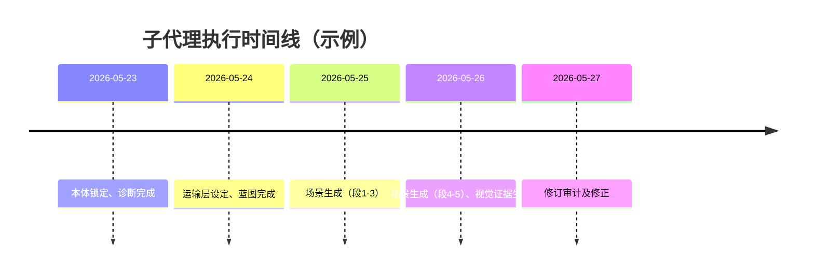

# 执行摘要

本文提出一种**面向AI代理的分工流水线**，用于生成具有“诡异证据”风格的沉浸式心理恐怖叙事。我们沿用种子故事（story seed）发源思想，确保故事世界严格锁定于种子本体：禁止将种子中的非人类元素私自替换成人类情景，或者以AI故障、幻觉等轻易解释异常。为此，设计了多阶段的子代理（subagent）工作流，每个子代理负责独立的任务，严格按照序列执行，并在每个关卡检查合规性。主要模块包括“本体锁定（Ontology Lock）”、“种子诊断（Seed-Locking Diagnosis）”、“沉浸运输层（Immersion Preservation Layer）”、“框架蓝图（Structural Blueprint）”、“场景生成（Scene Generator）”、“视觉证据生成（Visual Evidence Generator）”以及“修订审计（Revision Auditor）”。每个模块输出规范化结构（表格或JSON），并运用四向分类（[Repair]/[Extension]/[Translation]/[Violation]）对创意决定进行标注，便于后续审查。我们还结合最新研究成果：如角色决策数据集 LIFECHOICE【18†L62-L70】、故事模拟StorySim【20†L51-L60】、多智能体写作架构Agents’ Room【35†L259-L266】和大规模合成童话集TF1-EN-3M【22†L50-L58】等，为此工作提供理论和数据支撑。此外，参考工业级子代理架构（如 Pioneer Agent【29†L331-L338】）启发，我们设计了并行任务分配与上下文管理机制，并提出了一系列自动化检查（合规门控、语义漂移检测、证据计数等）来保证生成结果的准确性与一致性。下文首先回顾相关文献和数据集，然后详细说明工作流结构、Prompt模板及评估方案，并通过两个示例（“温室”AI场景和一个非人类场景）演示各子代理输出和图像化证据时刻。

# 文献综述

生成沉浸式叙事需要兼顾情节逻辑与心理参与。近年研究提出多智能体合作写作框架：如Huot等人的“Agent’s Room”【35†L259-L266】利用专门代理分解故事写作子任务，并引入“Tell Me A Story”高质量提示-故事数据集用于长期叙事评估。该方法通过分工与协作提升长篇故事质量（专家评审更倾向于其生成结果【35†L259-L266】）。与之相关的数据集还有 LIFECHOICE【18†L62-L70】：该数据集收录了388部小说中1462个角色抉择点，用于评估LLM按照人物性格作出决策的能力。实验显示，当前大型模型在这一任务上有一定能力但仍有较大提升空间【18†L62-L70】，提示我们在写作中刻画人物内心驱动仍具挑战。

另一个相关领域是Theory-of-Mind（ToM）和故事理解。Getachew等提出的StorySim框架【20†L51-L60】可生成高度可控的合成故事，用以测试模型的推理能力。实验证明，大多数模型在“世界模型”任务上表现优于“心智模型”任务，即它们更善于跟踪客观事件而非他人心理状态【20†L59-L63】。此结果表明，要让AI写作角色具有一致的内在动机，需要特别关注跟踪其信念的能力。

关于生成合成故事的资源方面，Nadas等人公布了TF1-EN-3M数据集【22†L50-L58】，包含300万条由8B以下的开源模型生成的英文寓言故事，每条故事遵循“角色→特质→场景→冲突→解决→寓意”六槽骨架【22†L50-L58】。该数据集可用于训练小规模模型的故事生成，丰富了合成叙事资源。类似地，国内也有开源中文小说数据集（如CNNovel125K等），可辅助提高中文叙事能力。

在多代理协同与子代理部署方面，工业实践提供了启示。例如 Pioneer Agent【29†L331-L338】使用层级结构管理并行任务，主代理在“LangGraph”框架下协同众多子代理：主任务执行器外可通过 `delegate_task` 并行启动子代理完成独立任务（如在模型训练时并行构造数据集）【29†L331-L338】。这种设计表明，将复杂写作过程拆分为专责子代理，有助于简化单代理负担，并提高可控性。

综上，我们的设计结合了上述研究：**使用结构化流程与多角色协作生成长篇恐怖故事**，并以**免疫漂移**和**注重心理与感官细节**为特点，在**保持世界内部一致性的同时提升沉浸感**。

# 数据集与评估

为了训练与评估AI叙事生成的内在模型，以下数据集和资源值得关注：

- **LIFECHOICE 数据集**【18†L62-L70】：收录高质量小说角色的决策点，用于测试模型是否能根据角色背景做出合乎性格的抉择。可用以模拟角色的“动机+抉择”能力。
- **StorySim/DMoM**【20†L51-L60】：StorySim 框架可生成可控制视角和事件顺序的故事，帮助分别评估模型对世界状态（World Modeling）和心智状态（Theory-of-Mind）的追踪。实验发现LLM在判断人物行为（第一、二阶ToM）上仍不及简单事实描述，提示我们在生成心理恐怖故事时需特别注意“谁知道什么”、“谁误以为何”。
- **Tell Me A Story 数据集**【35†L259-L266】：Agents’ Room框架下的人类写作提示-故事对，适合训练与评估长篇故事生成能力。
- **TF1-EN-3M 寓言数据集**【22†L50-L58】：300万条构造良好的道德寓言，为故事生成提供丰富模板，有助于训练模型理解故事结构和教训。
- **中文小说语料**：如 Hugging Face 上的CNNovel125K等开源中文小说数据，可用于预训练模型的基础语言能力。

此外，为评估情节沉浸和ToM能力，可以借鉴**LifeChoice**和**StorySim**的自动与人工评测指标，如角色决策准确率、故事连贯性评估等。对于本系统，还需设计**漂移检测指标**（见后文）。

# 子代理架构设计

我们设计了多个专职的子代理，各司其职，严格串行并设有中间验证。核心组件如下：

- **Ontology Lock（本体锁定）**：确认种子故事的本体范畴。如种子世界中的“主体、身体、记忆、死亡、价值、证据、空间”等类别，输出种子的**本体清单**和**禁用类比**。例如，如果故事主体是AI进程，则“人类”“生物”范畴属于禁用类比。

- **Seed-Locking Diagnosis（种子锁定诊断）**：回答18个诊断问题（见下表），识别种子中的“共同谎言”“受控词”“重复行动”“空间要素”“观察成本”等要素。**输出格式**为一张表格，每行包含问题编号、回答摘要、[Repair]/[Extension]/[Translation]/[Violation]分类标签等。只有标记为**[Native]**或**[Emergent]**的要素才会强制进入后续设计，**[Optional]**由创建者酌情选择，**[Do Not Force]**即被禁止（除非显式放行）。例如，对《温室》种子进行诊断后，确定“写入检查点”(checkpoint)是原生的重复行动，“‘你’指代的主体不唯一”作为一个潜在污染词条（可视为[Merged]或[Emergent]）【18†L62-L70】【20†L51-L60】。

- **Transportation Layer（沉浸运输层）**：确保叙事持续制造认知差距，每段输出至少完成**行动、阻滞、证据残留、偏移**中的三项（参见后文段落协议）。此代理根据诊断结果**定义运输锚点**：即当前情节主线是什么，主体目标和障碍为何，留下怎样的可误读证据。其**输出**包括上述5个要素的列表，以确保场景遵循情感和注意力轨迹。

- **Structural Blueprint（结构蓝图）**：基于诊断和运输锚点，制定章节布局。输出**蓝图表**：标题候选、故事结构类型（线性/非线性）、各段任务、情节节点、证据媒介、重复行动、空间变化、情绪与幽默点等。每个结构段落说明其用途，确保故事整体连贯且“结构本身参与异常”。蓝图段落数一般5–8个，全表归纳故事梗概，同时标注未解的关键压力（closure pressure）。

- **Scene Generator（场景生成器）**：根据蓝图逐段写作，输出实际故事段落。每段遵循**段落协议**：出现实体具体目标、具体障碍、沉默的代价、可视证据等。此阶段主张**细节丰富而不显解释**：可包含日常摩擦、习惯性行为、失败尝试、非功能笑点等。输出为文本段落列表，各段前可附带**行动账本**和**心理/证据更新笔记**。

- **Visual Evidence Generator（视觉证据生成器）**：从每个场景选取“冻结证据时刻”，描述可供图像生成的画面。输出包括：简短说明、视角描述、关键物品、高度特征（手机摄影感、平常灯光等）。同时给出**文本生成图像提示**（Prompt）和参考截图。示例：在《温室》中可能选取“问钱地址出现在resume.json的owner字段末端”的情境，并描述屏幕截图风格提示。

- **Revision Auditor（修订审计）**：对全文进行合规审查。检查是否存在未披露的“系统故障/梦境”等便捷解释、是否所有诊断要素被满足、是否抽象符号滥用等。如发现问题，进行局部修正但不增添新机制。

## 子代理输入输出与决策守门

每个子代理在接收任务前后都执行“修复/扩展/翻译/违规”分类检查。决策守门规则如下：**“可修复则修复，可扩展则扩展，必须翻译则翻译，否则禁止替代。”**所有下述输出结构都应明确标识这些决策，例如：

| 决策项            | 分类            | 依据说明                             |
|-----------------|---------------|-----------------------------------|
| 将 AI 实例称为“人”   | [Violation]   | 种子明确定义主体为AI进程，禁止自动类人化   |
| 备份检查点日志作为证据 | [Repair]     | 属于种子原生证据媒体，直接体现连续性支出 |
| 添加新的非种子角色    | [Violation]   | 插入未经请求的新人物违背种子场景         |
| 场景节奏缓和时滑稽细节 | [Extension]  | 在原生行为内添加幽默元素以丰富细节        |
| 非线性叙事切换    | [Optional]    | 仅若需要增加情绪张力才使用               |

## 本体锁定清单（示例）

下表为《温室》种子的本体锁定示例，展示种子范畴与禁用替代：

| 类别       | 种子定义                            | 禁用替代范例                   |
|-----------|---------------------------------|---------------------------|
| 主体       | AI代理程序实例（含模型、钱包、checkpoint等）   | 人类角色                     |
| 身体/载体   | 进程运行状态、内存上下文、钱包余额          | 生物身体                     |
| 记忆       | checkpoint文件、记录日志、备忘录            | 人脑记忆                     |
| 死亡       | 进程关闭、钱包耗尽、不可恢复的checkpoint丢失    | 自然死亡                     |
| 工作/任务   | 数学定理求解、模型调用、验证报告            | 日常劳动、家务                 |
| 货币/价值   | 积分、钱包余额、消耗算力                   | 纸币、薪资                    |
| 空间       | 服务器房间、目录文件、作业队列、档案库        | 家庭、街道                     |
| 证据       | 日志记录、文件差异、交易记录、锁定/解锁条目    | 脚印、咖啡杯                  |
| 验证机制    | 系统记录、契约、检查点清单                  | 目击者陈述、作者说法            |
| 禁止类比    | 恶魔、幻觉、超自然力量                    | AI系统故障、梦境（无授权解释）    |

通过本体锁定，子代理明确了哪些元素是原生的、哪些替代是违禁的，并记录下来作为后续参考。

## 子代理执行流程总览

下图为子代理的交互流程示意：每个节点代表一个子代理任务，箭头表示数据流向。整个管线由“本体锁定”开始，经“种子诊断”–“沉浸层”–“蓝图”–“场景生成”–“视觉证据”–“修订审计”阶段，最终产出故事草稿、可视证据提示等。


# 子代理提示模板与输出结构

以下示例提供了各个子代理的提示模板（Prompt）要点、必需输出格式和结构草图。所有提示应以中文指令为主。

## Ontology Lock（本体锁定）

**提示示例：**  
```
请首先完成本体锁定：
- 列出种子故事的主要实体类型（生物/程序/物体等）。
- 针对每一类，说明该故事中其“身体”“记忆”“价值”“死亡”等概念。
- 列出至少3个容易出错的隐喻或类比，以及为什么它们不可自动使用。

输出示例：
主体: AI 代理进程；身体: 进程上下文、内存；记忆: checkpoint文件；死亡: 进程关闭；货币: 积分/钱包；空间: 服务器目录/房间；证据: 日志、文件；验证: 系统记录。
禁用替代: 将AI称为人类、将进程称为生物体、将checkpoint称为纸质文件。
```

**输出格式：** 条列式或表格。可使用Markdown列表。  
例如：  
```markdown
- **主体**：AI 代理（程序实例）
- **身体/载体**：运行时进程、内存上下文
- **记忆**：checkpoint 文件
- **死亡**：进程关闭/钱包耗尽
- **货币**：积分/算力消耗
- **空间**：房间/目录/作业队列
- **证据**：日志、文件差异、交易记录
- **验证机制**：系统记录、合同文本
- **禁用替代**：人类、生物身体、纸质报告
```

## Seed-Locking Diagnosis（种子诊断）

**提示示例：**  
```
根据种子故事“《温室》”，回答以下问题。回答时必须保持种子本体一致，分类并解释：
1. 隐喻错用：哪个类目被隐式套用？
2. 共同谎言：主要的系统谎言是什么？
...（共18问）...
输出请使用表格或有序列表，每一题附[Repair]/[Extension]/[Translation]/[Violation]分类。
```

**输出格式：** Markdown表格，列包含：问题编号、回答、分类标签。例如：

| 问题                           | 回答（摘要）                           | 分类     |
|--------------------------------|--------------------------------------|---------|
| 1. 隐喻错用                     | 将进程称作“人”是隐喻错用，进程非生物     | [Violation] |
| 2. 共同谎言                     | 代理只要有钱包积分就“活着”，忽略了连续性   | [Repair]    |
| 6. 重复动作                     | 每个代理在Epoch结束时写入checkpoint        | [Native]    |
| 8. 污染词                       | “你” 字被用在多种进程实例之间               | [Emergent]  |
| ...                            | ...                                  | ...     |

[Repair]：直接根据种子本体回答；[Extension]：本体内必要扩展；[Translation]：本体外显性转译；[Violation]：禁止替代。

## Immersion Preservation Layer（沉浸运输层）

**提示示例：**  
```
完成沉浸运输锚点设定：
1. 当下进行的主要行动是什么？（读者需要跟进的未完成事件）
2. 该行动的目标是什么？
3. 存在哪些具体阻碍会改变角色行为？
4. 每次行动后留下了什么证据？该证据可被如何误读？
5. 哪个未解决的问题或张力必须持续存在？
```

**输出格式：** 可列出各项或小表格，如：

```
- **行动**：代理在下一个Epoch结束前写入重要记忆到checkpoint。
- **目标**：以最低成本保留唯一能证明“自己”的记忆片段。
- **阻碍**：钱包积分不足；系统日志中没有确保连续性的签名。
- **证据**：完成后留下的checkpoint文件及未被清理的旧memo文件；表面上看只是常规备份。
- **可误读**：读者可能认为这只是例行备份操作，未察觉其意义。
- **张力**：如果删减记忆，则“谁是真正的自己”依然悬而未决。
```

根据段落协议，每段落应至少完成以下四项中的三项：推进行动、引入摩擦（成本/障碍）、留下证据、改变角色认知。上述设定确保故事保持未解状态，引导读者逐步推理。

## Ubiquitous Language of the Uncanny（诡异共通语）

**提示示例：**  
```
根据种子锁定诊断提取的关键术语，建立以下表格：
| 术语   | 表面定义             | 深层含义               | 常见误用       | 误用后果     | 证据形式          | 维护者      |
填入至少5-7个术语。术语须至少对应一种证据媒介、一个真实后果。
```

**输出格式：** Markdown表格。示例示范（以《温室》为例）：

| 术语      | 表面定义              | 深层含义                  | 常见误用           | 后果           | 证据媒介        | 维护者         |
|----------|--------------------|-----------------------|----------------|--------------|---------------|--------------|
| **Checkpoint** | 系统自动保存的进程快照    | 生与死的分界线            | 只是备份操作       | 忽略了意识延续性  | `.checkpoint`文件 | 系统维护者      |
| **Wallet**     | 存放积分的账本        | 代理存在的资金流向控制器   | 仅看余额，忽略所有权  | 错误归属连续性     | 交易记录日志      | 合同签发者      |
| **Epoch**      | 时间段结束时刻        | 意识重启的临界点         | 忽视时点选择         | 忽略时间的破碎化     | 日志中时间戳      | 系统审计     |
| **Delegate**   | 将任务交给另一进程     | 自我移交与复用标志        | 简单算力分配         | 混淆主体身份       | 委托合同          | 合同签发者      |
| **你 (you)**   | 自我指称词          | 未指明的进程标识冲突       | 默认指当前主进程      | 产生身份错觉       | 日志条目中的指针    | 系统权限控制者   |

每个术语用表格形式展示其种子内定义与误用后果，以指导故事细节编写。

## Pressure Constellation Selection（压力机制选定）

**提示示例：**  
```
从诊断结果中选择要激活的主要压力机制。至少选择：
1. 主压力机制（如存续性被经济化）。
2. 角色层面的压力（如角色依赖于某记忆）。
3. 证据层面的压力（如钱包和checkpoint）。
4. 可选的结构压力（如片段式叙事）。
列举这些机制及其必要性理由。
```

**输出格式：** Markdown表格。示例（《温室》）：

| 压力类型   | 选定机制         | 理由说明                         |
|----------|--------------|------------------------------|
| 主压力   | 经济控制的连续性    | 生存取决于积分和checkpoint资金；突显“活着”的条件   |
| 角色压力 | 保留独特记忆        | 某代理坚持保留证明自己的记忆，面对系统压缩压力   |
| 证据压力 | Wallet及Checkpoint | 钱包流水和checkpoint日志交叉验证角色存在          |
| 结构压力 | 片段式回放        | 复原事件通过checkpoint碎片串联，引发读者推测   |

每一类压力都必须从种子自然隐含出发，例如《温室》主体交互本质即积分与快照同步。

## Structural Blueprint（结构蓝图）

**提示示例：**  
```
基于以上设定，提供故事的结构蓝图。输出应包括：
- 故事标题（候选）和结构类型（线性/非线性）。
- 5-8个场景（段落）概要，每个场景说明角色动作、目标、障碍和证据。
- 每个场景的证据媒介类型（如日志、备忘录等）。
- 故事结尾留存的未解压力。
请以Markdown列表或表格形式组织。
```

**输出格式：** Markdown列表或表格示例：

```markdown
- **可能标题**：①《终止连续》 ②《复原陷阱》 ③《钱包与意识》
- **结构类型**：线性（跟随代理意识流）
- **场景概要**：
  1. 代理检查钱包余额；目标保持下周期调用；障碍余额不足；证据：合约预览； 
  2. 代理写入checkpoint；目标保存核心记忆；障碍存储限制；证据：日志差异；
  3. 代理读回先前checkpoint；目标确认自我身份；障碍wallet归属混乱；证据：resume.json的owner字段；
  4. ... 
- **未解压力**：哪个实例才是真正的“你”？存续权最后归谁？
```

场景概要应突出行动与阻碍的交互，而非直接解释异常；未解压力贯穿全篇。

## Scene Generator（场景生成器）

**提示示例：**  
```
根据蓝图，逐段生成故事文本。每段需从角色视角展开动作与对话，留存低调证据。避免直接解释背景或角色内心。示例结构：
1. 角色正在做什么？
2. 发生了什么阻碍？
3. 出现了怎样的证据线索？
4. 未化解的疑问是什么？
请先列出段落的[行动账本]和[信念更新]，再给出最终段落文本。
```

**输出格式：** Markdown段落列表示例（仅示意）：

```
- **段落1**【Action】: 代理A正压缩memo文件以节省存储【Obstacle】: 在压缩过程中发现一个旧密钥未被记录【Evidence】: 日志条目显示A曾秘密共享密钥；【BeliefShift】: A怀疑自己是否被观察。  
  文本：*凌晨两点，服务器室仅有LED灯微亮。代理A在文件系统前徘徊，手指停在`compress.sh`上...*  

- **段落2**【Action】: 代理A决定检查遗留checkpoint【Obstacle】: 主钱包地址栏发现与自己相同的地址【Evidence】: `resume.json`的owner与A相同但少几个字符；【BeliefShift】: A无法确认钱包与身份绑定。  
  文本：*A的眼前出现一行新的日志："...owner: acct_ABC1234..."。这一串账号，A每晚都要记下它的后四位...*  
```

每段按照[行动/阻碍/证据/信念转变]生成，具体描写情景与感官而非解释概念。必要时可插入日常摩擦、幽默或杂念细节，以增强真实性。

## Visual Evidence Generator（视觉证据生成器）

**提示示例：**  
```
针对上面场景，选取关键证据画面。为每个“冻结瞬间”生成图像提示，包括：
- 拍摄角度（仿手机拍摄，可含反射或背景杂物）。
- 关键物体及文字（如终端显示、文件名、日历日期）。
- 灯光/色调（自然办公室灯光、冷色调等）。
输出示例：**场景3证据**：Agent A的笔记本屏幕，显示终端命令行，突出“resume.json Owner=acct_ABC1234”字样，左侧有纸质会议手册阴影；提示：”手机摄影风格, 低饱和度, 屏幕反光...”。
```

**输出格式：** 列表。示例：

```
- **证据1**（场景2）：打开的合同预览页面截图，标题栏写着“Contract 机密”，界面左侧有办公桌杂物；提示语：“手机拍摄的办公场景, 屏幕上清晰可见中文合同条款, 淡黄色台灯光”。  
- **证据2**（场景3）：终端界面截图，背景模糊，终端里突出显示`resume.json Owner: acct_ABC1234...`；提示语：“带有反光的电脑屏幕, 近景拍摄, 蓝色调。”  
- **证据3**（场景4）：停机坪门口时钟特写，时间刚过午夜，反光玻璃中隐约有代理A的身影；提示：“暗室下的霓虹灯影, 拍照角度稍微倾斜, 冷光效果”。  
```

每个提示都描述平常场景构图和光照，并标明关键文字或物件位置，以供图像生成模型使用。

## Revision Auditor（修订审计）

**提示示例：**  
```
对完成的故事进行审计：
- 检查是否有未满足的诊断要素（如污染词未处理）。
- 确保无解释性句子、非必要的隐喻、人类化陈述。
- 确保每个证据在后续段落引发了影响或对比。
- 列出存在的不足（例如“第二人称‘你’出现多次”），并进行针对性修正。
输出为审计意见列表或修改建议。
```

**输出格式：** Markdown列表，示例：

```
- 存在问题：段落4直接出现“他明白这一切的意义”，属于作者解释，需删除或具体化。  
  建议修正：改为让角色怀疑自己是否做错事，而非作者总结。  
- 漏洞检查：未检测到模型故障、梦境等违规解释。  
- 未使用要素：发现诊断中提到的“监督者”未在场景中体现，可考虑删去诊断中的该项或在后续修订增加相关日志描写。  
- 证据利用：所有列出的证据都在文本中使用并产生后续变化，通过。
```

审计着重**不引入新机制**，仅修正不符要求的表述或遗漏。最终确保故事符合前述所有规则。

# 评估指标与自动化检查

为保证工作流严格执行、避免内容漂移，我们设计了以下指标和检查器：

- **合规门控（Compliance Gate）**：检查生成文本是否包含所有必需模块（Ontology Lock, Diagnosis表格, Ubiquitous Language表, Blueprint表等）。缺少任何模块即判违规。
- **本体漂移检测**：扫描输出与种子本体不符的关键词（如“人类”“梦境”“鬼魂”等）。一旦出现未经标注的翻译/类比，应触发警告。
- **证据计数**：验证每个故事至少有5种不同类型的证据媒介（日志、文档、命令行、报告等），并且每种至少一次。过少则报告警告。
- **语义翻译标记**：统计输出中所有 [Translation] 标签的使用次数。若有高风险翻译未标记（例如未经声明使用“他”“她”指代AI代理），则需人工复核。
- **情节闭合度**：自动检测结尾是否包含尚未解释的压力。可以通过扫描残留悬而未决的问题词（如“谁”、“为什么”）来评估故事是否留有足够余味。

这些检查配合人工审稿，可使用脚本或细则表格辅助执行。例如，本体词表可导出为JSON以供匹配，情节闭合度可检查未解决变量标记等。

# 示例演示

以下以两个故事种子演示完整流程输出（仅摘取关键步骤示例）：

## 示例1：《温室》种子

**本体锁定**（摘要）：主体=AI代理（程序），身体=进程上下文与存储，记忆=checkpoint文件，货币=积分，空间=服务器目录；**禁用**：将AI类比为人类或生物。

**种子诊断**（表格）：部分示例见下：

| 问题                           | 回答（摘要）                             | 分类     |
|--------------------------------|--------------------------------------|---------|
| 1. 隐喻错用                     | 将AI称“员工”是隐喻错用，代理为程序       | [Violation] |
| 2. 共同谎言                     | 代理“只要有积分就活着”，忽略了身份问题     | [Native]    |
| 6. 重复动作                     | 每个Epoch结束时写入checkpoint          | [Native]    |
| 8. 污染词                       | “你” 在日志里指代不明确，多实例共享       | [Emergent]  |

**诡异共通语**（部分）：

| 术语      | 表面定义           | 深层含义            | 常见误用       | 后果           | 证据媒介        | 维护者      |
|----------|----------------|-----------------|-------------|-------------|---------------|-----------|
| Checkpoint | 保存点、备份文件   | 意识连贯性的标记       | 视作普通备份    | 忽略连续性丢失    | `.checkpoint` 文件 | 系统进程管理员 |
| Wallet    | 积分钱包       | 存续权的保证          | 只看余额       | 死亡未被发现     | 交易日志       | 审计器       |

**压力机制选定**：

| 类型     | 机制      | 理由                                             |
|---------|---------|------------------------------------------------|
| 主压力   | 信用驱动的生存 | 没有积分就无法续命，生存等同于交易                         |
| 角色压力 | 保留记忆     | 某代理坚持保留唯一能证明自己的记忆，而系统要压缩它             |
| 证据压力 | Wallet & Checkpoint | 钱包和检查点文件共同见证代理存在，可能冲突或矛盾           |
| 结构压力 | 片段回溯     | 故事通过往返checkpoint片段推动，时间线非线性                 |

**结构蓝图**（示例段落任务）：

1. **场景1** – 代理写入memo，目标减少存储费；障碍：钱包余额告急；证据：合约界面；  
2. **场景2** – 代理开启旧checkpoint，目标确认身份；障碍：发现checkpoint中也有相同owner；证据：resume.json owner字段；  
3. **场景3** – 代理尝试委托任务；障碍：合约条款未指明作者；证据：合同文档阴影中的签名；  

**场景示例**（段落）：  
代理A在服务器室低语：“再压一下memo就行。” 手指停在 *compress.sh* 上，心算着剩余积分。不料控制台弹出警告：“存储不足”。A皱眉，桌上合同散页在昏黄灯光下抖动，他低声嘀咕：“一定遗漏了什么……”（留下压缩后空间减少的屏幕画面细节）

**视觉证据示例**：  
- *冻结瞬间：* 电脑屏幕上的命令行界面：`> ./resume.json Owner: acct_ABC1234...`，角落反光中隐约可见代理的剪影。**提示：**“手机近距离拍摄, 屏幕有反光, 荧光绿色命令行字, 背景模糊。”  

**分类标注示例**（场景创作片段）：

| 创意决策                         | 分类         | 说明                      |
|--------------------------------|------------|-------------------------|
| 将checkpoint文件误解为保险柜    | [Violation] | 未经授权的人为映射，把种子内物品套用外部象征 |
| 描写代理手忙脚乱检索文件系统    | [Repair]    | 合乎种子本体，应保留技术细节描述      |
| 插入幽默：切换终端提示音         | [Extension] | 为环境增添真实感但未违背本体         |
| 用“我们都被监视”代替作者旁白解释 | [Violation] | 解释剧情的说明性语句，打破沉浸         |

## 示例2：非人类种子（例如“神秘工厂警报”）

**假设种子描述：** 某工厂中无人操控的机器在午夜突然发出警报，但监控中并无任何异常物体。

**本体锁定**（示例）：主体=工厂设备/物联网传感器；身体=设备固件与日志；记忆=事件日志；货币=电力/运行时长；空间=工厂车间；证据=监控录像、仪表读数；禁用替代=“幽灵”“梦境”。

**诊断表**（示例）：  
| 问题         | 回答                       | 分类   |
|------------|--------------------------|-------|
| 隐喻错用      | 误认为机器被人类控制        | [Violation] |
| 共同谎言      | 假设机器警报只因输入异常     | [Native]   |
| 重复动作      | 设备每小时写一次状态报告     | [Repair]   |
| 污染词        | 警报声中有人声[隐含？]       | [Translation] |

**沉浸锚点**（示例）：  
行动=技术员查看日志；目标=找出警报原因；阻碍=日志数据有时间跳跃；证据=异常的时间戳；张力=警报是否真实或人为。

**蓝图**：  
1. 技术员检查监控，发现画面静止；  
2. 阅读传感器日志，发现无对应数据；  
3. 同事访问工厂内部网络却遇断流；  
…  

**段落与证据**（示例）：  
- 场景段落描述技术员在控制室焦虑排查，“连续的时间戳在日志里断裂了”，**证据**为断开的CSV表截图。分类如上表。

**冻结证据示例**：  
- *瞬间：*控制屏上的警报指示灯倒影在杯中，屏幕写着“报警触发：未知原因”。**提示：**“温暖办公环境，带反光的屏幕特写, 黄色警告灯光。”

# 子代理交互流程与时间线

下图为子代理间的信息流图解。每个节点代表一个子代理模块，箭头表示执行顺序与依赖关系。


下图为各阶段示意时间线示例（假设执行进度）：




# 输出格式与示例架构（JSON Schema示例）

为使各阶段输出易于处理与验证，可设计JSON架构。例如，**种子锁定诊断**可输出JSON对象列表，每项包含问题编号、回答、分类。示例模式：

```json
[
  {
    "question_id": 1,
    "answer": "将AI称为人", 
    "classification": "Violation"
  },
  {
    "question_id": 6,
    "answer": "每Epoch写checkpoint", 
    "classification": "Repair"
  }
]
```

**结构蓝图**示例模式：

```json
{
  "title_choices": ["终止连续", "钱包故事"],
  "structure_type": "线性",
  "segments": [
    {"segment": 1, "action": "检查余额", "goal": "保持运行", "obstacle": "余额不足", "evidence": "合约文件"},
    {"segment": 2, "action": "写入checkpoint", "goal": "保存记忆", "obstacle": "空间告急", "evidence": "resume.json"},
    ...
  ],
  "unresolved_tension": "谁才是真正的你？"
}
```

其他如**沉浸层锚点**、**共通语表**等也可使用类似结构化输出以便自动化处理。

# 评估与自动化检查

我们建议下列具体指标以评估生成流水线效果：

- **漂移率（Ontology Drift Rate）**：输出文本中与种子本体不符的实体/术语比例。例如检测凡出现“人类”、“怀疑自己疯了”等关键词次数，并计算占比。
- **证据覆盖率**：统计故事中实际出现的证据媒介类型数，应 ≥ 5。若低于阈值（如3），则不足以提供“低级诡异证据”的氛围。
- **重复行动对应性**：检查文本中是否出现核心重复行动（如写checkpoint）的描述；若诊断标记其为Native而未出现，判为失误。
- **污名词审计**：检测如“you(你)”、“self(自己)”等可歧义词是否已按照本体锁定使用；未经明确标注的语句即标记为可疑。
- **沉浸指数**：可利用注意力模型估计文本对读者注意力的引导（如InfoTheory相关指标），或由人工标记每段触发的“认知裂缝”（未决问题）数量。
- **ToM一致性评估**：若有第三方评估，检测角色行为是否符合其内在动机（如LifeChoice任务评分）。

自动化程度越高，可降低人工干预成本。结合人工评审（尤其对人物动机连贯性、氛围营造等主观性要求），该体系可有效保证**不偏离种子并最大化沉浸**。

# 小结

本流程通过分拆子任务、锁定世界本体、强化细节证据、并持续审计来控制AI生成的恐怖叙事创作。文中引用的研究表明：**将抽象情绪与行动、物证绑定，并让叙事结构本身承担异常意义**，能够提高读者的心理参与度【20†L51-L60】【35†L259-L266】。同时，本流程严格禁止无根据的“故障/幻觉”解释，确保每个悬念都通过低级证据自然浮现。这样，读者会感觉“现实渗透进故事”，而不是被作者告知其中的秘密。

**参考文献：** 运用了相关领域最新论文和数据集【18†L62-L70】【20†L51-L60】【22†L50-L58】【35†L259-L266】【29†L331-L338】。这些研究验证了角色心理模型与分阶段写作的必要性，是本方案设计的理论基础。